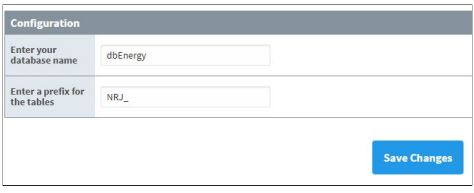
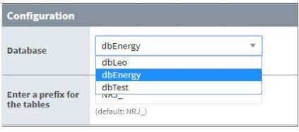

# nrj
Module Energie intégrable dans Ignition

* Explications
* Intégration
* Modifications

## Explications
Le module énergie est un module Java intégrable dans le logiciel Ignition, ainsi que pour son application web.
Son principe est le suivant : une solution clé en main pour les utilisateurs qui souhaiteraient calculer la consommation d'énergie d'un automate, comme un compteur électrique par exemple.

Du coté utilisateur, rien de plus simple ; installer le module sur l'application web, le configurer en choisissant parmi les bases de données disponibles celle qui va emmagasiner les données ainsi qu'un suffixe pour les tables, puis entrer dans le logiciel et appliquer la fonction de calcul de consommation  du module sur un automate (avec par exemple une récupération des données toutes les minutes) et le tour est joué ! Une base de donnée et des tables se créent automatiquement et les données de l'automate sont poussées sur celles-ci.

## Intégration

## Modifications
